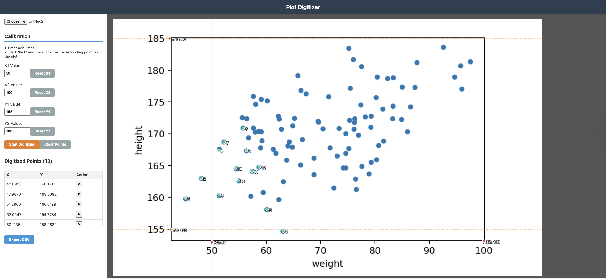

# Plot Digitizer



A lightweight, web-based tool built with React and TypeScript to extract numerical data from plot images (line charts, scatter plots, etc.) using linear interpolation.

**Purpose:** This software was originally developed to recover data from legacy scientific articles and publications where the original raw data is no longer accessible. It provides a straightforward method to accurately digitize and extract data points directly from visual plots.

## Features
- **Easy Calibration:** Map image pixels to real-world data values by picking just 4 points.
- **Visual Feedback:** Dashed calibration lines help you align with plot axes perfectly.
- **Live Recalculation:** Update axis limits at any time; all digitized points update instantly.
- **High Precision:** Scrollable canvas allows working with high-resolution images.
- **CSV Export:** Download your digitized data with a single click.
- **Dockerized:** Ready for containerized deployment.

---

## Quick Start

### 1. Local Development
Ensure you have [Node.js](https://nodejs.org/) installed.
```bash
npm install
npm run dev
```
Open `http://localhost:5173` in your browser.

### 2. Using Docker
```bash
docker build -t plot-digitizer .
docker run -p 8080:80 plot-digitizer
```
Open `http://localhost:8080` in your browser.

---

## How to Use: Step-by-Step Guide

### Step 1: Upload Image
Click the file input in the sidebar to upload an image of the plot you want to digitize. Supported formats include PNG, JPG, and WEBP.

### Step 2: Calibrate the Axes
Calibration tells the tool how pixels relate to your data units. You need to define two points on the X-axis and two points on the Y-axis.

1.  **Enter Values:** In the "Calibration" section, enter the known numerical values for your markers (e.g., `X1 = 0`, `X2 = 100`).
2.  **Pick Pixels:** 
    - Click the **Pick X1** button.
    - Click the corresponding location on the X-axis of your image. A red vertical dashed line will appear.
    - Repeat this for **X2**, **Y1**, and **Y2**.
3.  **Verify Alignment:** Use the dashed lines to ensure your picks are perfectly aligned with the grid lines or axis ticks of the plot. You can "Re-pick" any point if it's slightly off.

### Step 3: Digitize Points
1.  Once all 4 calibration points are set, click **Start Digitizing**. Your cursor will change to a crosshair over the image.
2.  Click on any data point in the plot.
3.  The extracted **X** and **Y** values will appear in the table in the sidebar.

### Step 4: Export Data
Review your points in the table. You can remove individual points using the `×` button. When finished, click **Export CSV** to download the data for use in Excel, Python, or other tools.

---

## Technical Details: How Scaling Works
The tool uses **Linear Interpolation**. When you click a point at pixel coordinate $P$, the data value $V$ is calculated as:

$$V = V_{min} + \frac{(P - P_{min}) \times (V_{max} - V_{min})}{P_{max} - P_{min}}$$

- **X-axis:** Uses $P_x$, $P_{x1}$, and $P_{x2}$.
- **Y-axis:** Uses $P_y$, $P_{y1}$, and $P_{y2}$.

Because the logic is "live," changing $V_{min}$ or $V_{max}$ in the sidebar will immediately update the $V$ for every point you have already clicked.

---

## Author
**Giuseppe Marco Randazzo**  
Email: [gmrandazzo@gmail.com](mailto:gmrandazzo@gmail.com)
